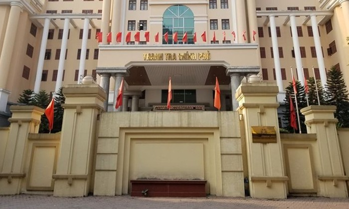

# 📰 Giao Diện Trang Báo Tiền Phong

Dự án này là một trang web mô phỏng giao diện của báo **Tiền Phong**, được xây dựng bằng HTML và CSS thuần. Giao diện gồm các phần: banner, thanh điều hướng, ô tìm kiếm, thông tin liên hệ, tin nổi bật, tin mới và chân trang.

## 📁 Cấu Trúc Thư Mục

📁 project-root/ ├── index.html ├── style.css ├── img/ │ ├── banner-top-ky-nguyen-9511.jpg │ ├── tải xuống.png │ ├── banner-bao-tien-phong-1276x90px-2003-2285.jpg │ ├── 124ttracp-522-8143.jpg │ ├── tin1.jpg │ └── tin2.jpg

## 🚀 Tính Năng

- ✅ Banner đầu trang và giữa trang
- ✅ Thanh thông tin với hotline và icon mạng xã hội
- ✅ Logo và thanh tìm kiếm
- ✅ Menu điều hướng các chuyên mục như Xã hội, Kinh tế, Thể thao, v.v.
- ✅ Tin nổi bật với ảnh lớn, tiêu đề và mô tả
- ✅ Khu vực tin tức mới nhất
- ✅ Tự động hiển thị ngày hiện tại bằng JavaScript
- ✅ Giao diện thân thiện và dễ đọc

## 🖼️ Hình Ảnh Demo




## 🌐 Công Nghệ Sử Dụng

- **HTML5**: Cấu trúc nội dung trang
- **CSS3**: Tạo kiểu giao diện người dùng
- **JavaScript**: Hiển thị ngày tự động

## 📌 Hướng Dẫn Sử Dụng

1. Clone hoặc tải xuống dự án:
   ```bash
   git clone https://github.com/ten-ban/readme-tienphong.git
